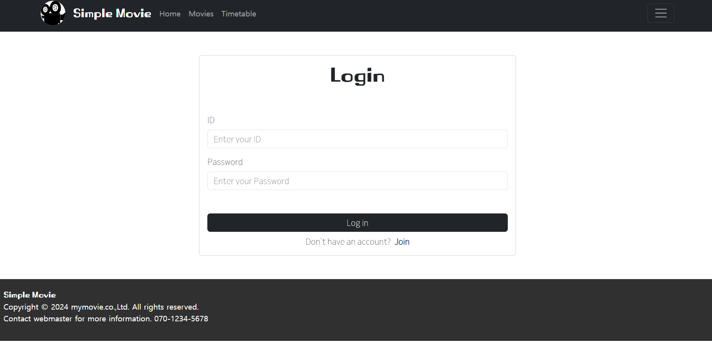

# 📽️ mymov client

## 📌 개요
1. [프로젝트 소개](#-프로젝트-소개)
2. [팀 구성](#-팀-구성)
3. [기술 스택](#-기술-스택)
4. [주요 기능](#-주요-기능)
5. [구현](#-구현)
6. [시연](#-시연)
7. [회고](#-회고)

## 📌 프로젝트 소개
- 영화 플랫폼의 여러 기능 중 일부인 상영중인 **영화 정보의 제공**과 **예매표 구매**를 돕는 웹입니다.
- 관리자 웹과 사용자 웹으로 구성되어 있습니다.
- 관리자는 영화와 관련한 장르, 영화, 영화관, 상영관, 좌석, 상영표 등 컨텐츠 관리할 수 있습니다.
- 사용자는 회원 가입과 정보 수정, 탈퇴, 영화 조회, 상영표 조회, 예매하기, 예매표 조회 등 이용할 수 있습니다.

## 📌 팀 구성
- 인원: 1명(개인)
- 역할: 웹 퍼블리싱 및 프론트엔드 개발

## 📌 기술 스택
- html, css, js
- React.js
- Bootstrap

## 📌 주요 기능
- 관리자 웹
    - 영화, 영화관, 상영표를 등록하여 사용자에게 컨텐츠를 제공합니다.
    - 필요에 따라 영화 정보의 수정이 가능합니다.
    - 불필요하거나 유효하지 않은 영화, 영화관, 상영표 등의 컨텐츠를 삭제할 수 있습니다.

- 사용자 웹
    - 서비스 이용을 위해 회원가입과 로그인을 할 수 있습니다.
    - 영화 페이지에서 개봉한 영화 목록을 확인할 수 있습니다.
    - 상영표 페이지에서 상영 중인 영화 목록을 확인할 수 있습니다.
    - 예매하기 기능을 통해 예매표를 구매할 수 있습니다.
    - 마이페이지에서 개인정보변경과 예매 현황을 확인할 수 있고, 서비스 이용 중단을 원할 경우 회원탈퇴를 할 수 있습니다.

## 📌 구현
- ### 구현 요소는 아래와 같고, 대표적인 코드를 링크를 통해 확인하실 수 있습니다.

- Router
    - [코드 바로가기]()
- Page
    - [코드 바로가기]()
- Component
    - [코드 바로가기]()
- HTTP
    - [코드 바로가기]()

## 📌 시연

[관리자 웹] 로그인

[관리자 웹] 장르 관리하기

[관리자 웹] 영화 관리하기

[관리자 웹] 영화관 관리하기

[관리자 웹] 상영관 관리하기

[관리자 웹] 좌석 관리하기

[관리자 웹] 상영표 관리하기

[사용자 웹] 홈

[사용자 웹] 회원가입

[사용자 웹] 로그인

[사용자 웹] 영화 목록

[사용자 웹] 영화 상세

[사용자 웹] 상영표 목록

[사용자 웹] 예매하기

[사용자 웹] 마이페이지 개인정보변경

[사용자 웹] 마이페이지 예매현황

[사용자 웹] 마이페이지 탈퇴하기

## 📌 회고